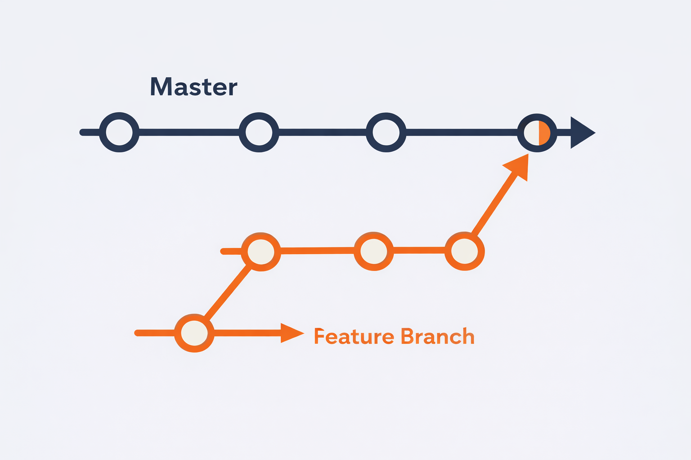

# Chapter 7.5 — Introduction to Professional Git Workflow

In Part 1, you learned how to use Git as an individual developer.

You learned how to:

* Create a repository
* Add files
* Commit changes
* Push to GitHub
* Pull updates
* Clone projects

You now understand how Git tracks your work.

But real software is not built by one person.

Real software is built by teams.

Sometimes small teams.
Sometimes large teams.
Sometimes hundreds or thousands of developers working on the same project.

Git was designed for this exact purpose.

---

## From Personal Tool to Professional System

In Part 1, your workflow looked like this:

You worked on your computer.
You pushed your code to GitHub.
GitHub stored your project safely.

This works perfectly when only one person is involved.

But what happens when multiple developers work on the same project?

---

## The Multi-Developer Reality

In professional environments, many developers work on the same repository.

Each developer:

* Writes code
* Adds features
* Fixes bugs
* Improves the project

All of them interact with the same GitHub repository.

Git allows multiple developers to collaborate efficiently by sharing and synchronizing code through a central repository. 

This is what makes modern software development possible.

---

## The Problem Without Proper Workflow

If multiple developers directly modify the same code without structure, problems can occur.

For example:

* Developer A modifies a file
* Developer B modifies the same file
* Both push changes

This can create conflicts, overwrite changes, or break the project.

This is dangerous.

Professional projects must remain stable at all times.

The main version of the project must always be reliable.

---

## The Professional Solution — Structured Workflow

Git solves this problem using a professional workflow based on branches.

Instead of everyone modifying the main project directly, developers create separate branches.

A branch is an isolated copy of the project where developers can safely make changes without affecting the main code.

This allows developers to:

* Work independently
* Build new features safely
* Fix bugs without risk
* Experiment without breaking the main project

When the work is complete, it can be safely merged into the main project.

This keeps the project stable and organized.

---

## How Professional Teams Use Git

Professional workflow follows this structure:

1. Main branch contains stable project
2. Developers create separate branches
3. Developers work on their branch
4. Changes are tested and reviewed
5. Changes are merged into main branch

This ensures:

* Stability
* Safety
* Collaboration
* Scalability

Feature branches allow multiple developers to work without disturbing the main project, keeping the main branch stable.

This workflow is used by companies worldwide.

---

## What You Will Learn in Part 2

In this part, you will learn:

* What branches are
* Why branches exist
* How to create branches
* How to switch branches
* How to merge branches
* How professional teams manage code

You are now moving from beginner Git usage to professional Git workflow.

This is how real software is built.

This is how modern development works.

This is the workflow used in production systems worldwide.